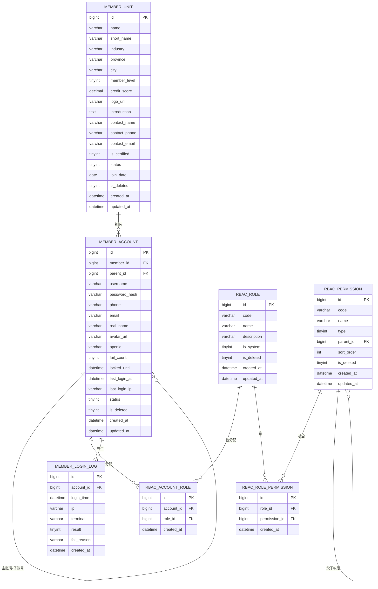
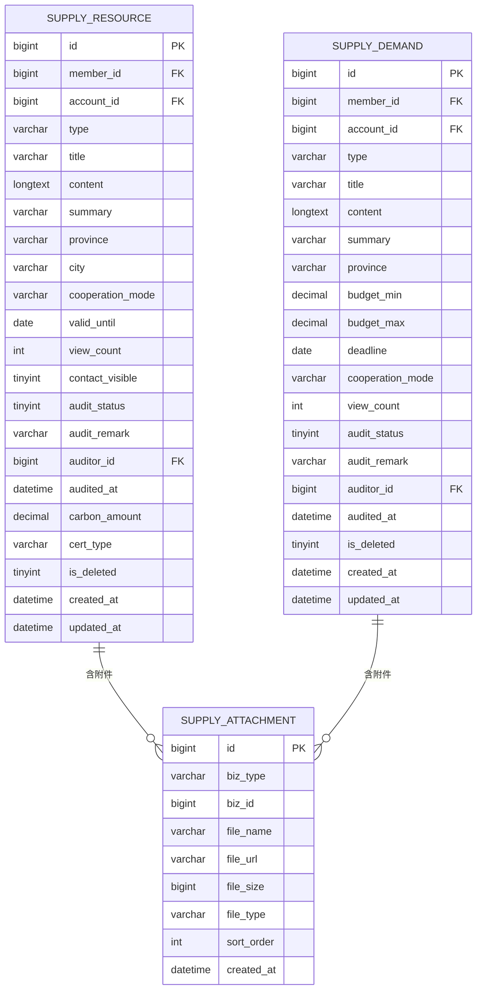
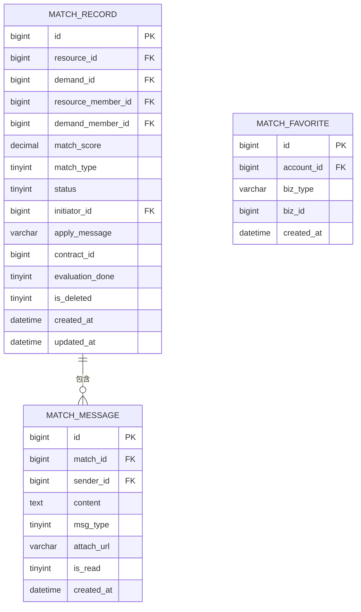
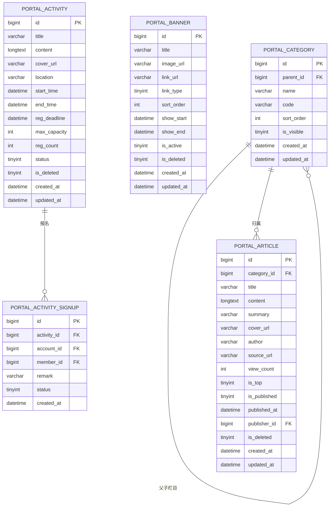
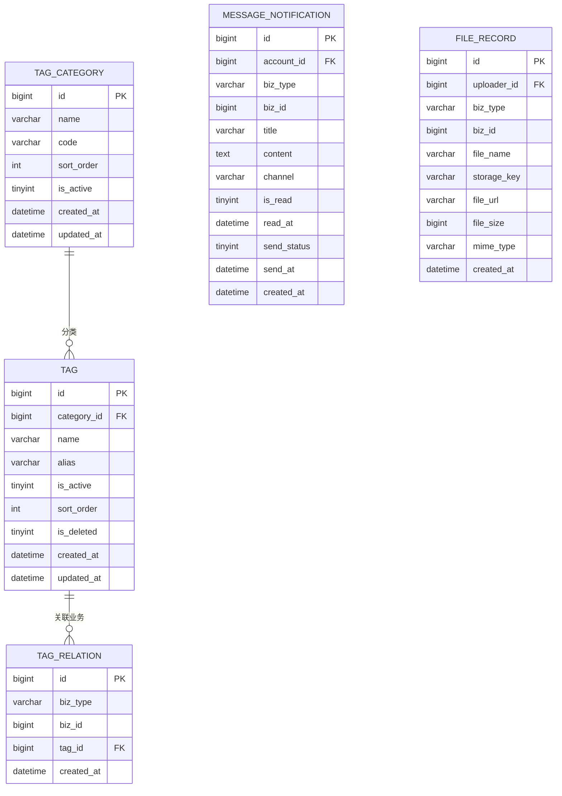

# 绿产智链（Green-Link）数据库设计文档

> **项目**：山东省绿色低碳产业生态智慧链接平台  
> **版本**：V1.0（一期）  
> **数据库**：MySQL 8.x（主从复制）  
> **文档状态**：正式版  
> **编制日期**：2026-06-03  

---

## 目录

1. [设计原则与规范](#1-设计原则与规范)
2. [Schema 总览](#2-schema-总览)
3. [实体关系图（ERD）](#3-实体关系图erd)
4. [详细表设计与 DDL](#4-详细表设计与-ddl)
   - 4.1 [gl_member — 会员与权限域](#41-gl_member--会员与权限域)
   - 4.2 [gl_supply — 供需对接域](#42-gl_supply--供需对接域)
   - 4.3 [gl_match — 匹配对接域](#43-gl_match--匹配对接域)
   - 4.4 [gl_portal — 门户内容域](#44-gl_portal--门户内容域)
   - 4.5 [gl_common — 公共支撑域](#45-gl_common--公共支撑域)
5. [索引策略](#5-索引策略)
6. [分区策略](#6-分区策略)
7. [二期预留字段清单](#7-二期预留字段清单)
8. [数据字典（枚举值）](#8-数据字典枚举值)
9. [Redis 缓存设计](#9-redis-缓存设计)
10. [Elasticsearch 索引设计](#10-elasticsearch-索引设计)
11. [变更记录](#11-变更记录)

---

## 1. 设计原则与规范

### 1.1 全局约定

| 规范项 | 约定值 |
|---|---|
| 字符集 | `utf8mb4` |
| 排序规则 | `utf8mb4_unicode_ci` |
| 存储引擎 | `InnoDB` |
| 主键类型 | `BIGINT UNSIGNED AUTO_INCREMENT`，字段名统一为 `id` |
| 时间字段 | 所有表必须含 `created_at`、`updated_at`（含 DEFAULT 与 ON UPDATE） |
| 软删除 | 所有业务表含 `is_deleted TINYINT(1) DEFAULT 0`，禁止物理删除 |
| 命名风格 | 表名、字段名一律 `snake_case`；表名以域前缀区分 |
| 外键约束 | 不在数据库层面声明外键，关联完整性由应用层保证 |
| 布尔字段 | 统一用 `TINYINT(1)`，0=否，1=是 |
| 金额字段 | 统一用 `DECIMAL(15,2)`，单位：元 |
| 枚举字段 | 用 `TINYINT` 存储数值，含义通过注释 + 数据字典说明 |

### 1.2 字段注释规范

所有字段必须含 `COMMENT`，注释格式如下：

```
-- 简单字段：直接描述含义
`status` TINYINT NOT NULL DEFAULT 1 COMMENT '状态 0禁用 1正常 2审核中'

-- 枚举字段：列出所有可选值
`type` VARCHAR(50) NOT NULL COMMENT '类型 PRODUCT产品 TECHNOLOGY技术 TALENT人才'

-- 预留字段：标注二期
`carbon_amount` DECIMAL(15,4) DEFAULT NULL COMMENT '碳减排量（tCO₂e，预留二期）'

-- 关联字段：标注关联表
`member_id` BIGINT UNSIGNED NOT NULL COMMENT '所属会员单位 → member_unit.id'
```

### 1.3 Schema 与服务映射

| Schema | 对应微服务 | 说明 |
|---|---|---|
| `gl_member` | `gl-auth` + `gl-member` | 会员、账号、RBAC、登录日志 |
| `gl_supply` | `gl-supply` | 资源/需求发布、附件 |
| `gl_match` | `gl-match` | 匹配记录、沟通消息、收藏 |
| `gl_portal` | `gl-portal` | 门户栏目、文章、活动 |
| `gl_common` | `gl-file` + `gl-message` | 公共支撑：文件、消息、标签 |

---

## 2. Schema 总览

### 2.1 表清单

| Schema | 表名 | 中文名 | 预估行量（一期末） |
|---|---|---|---|
| gl_member | `member_unit` | 会员单位 | 500–2000 |
| gl_member | `member_account` | 会员账号 | 1000–5000 |
| gl_member | `rbac_role` | 角色 | < 20 |
| gl_member | `rbac_permission` | 权限项 | < 200 |
| gl_member | `rbac_role_permission` | 角色权限关联 | < 500 |
| gl_member | `rbac_account_role` | 账号角色关联 | 1000–5000 |
| gl_member | `member_login_log` | 登录日志 | 高频，需分区 |
| gl_supply | `supply_resource` | 资源发布 | 2000–10000 |
| gl_supply | `supply_demand` | 需求发布 | 1000–5000 |
| gl_supply | `supply_attachment` | 资源需求附件 | 5000–20000 |
| gl_match | `match_record` | 匹配对接记录 | 5000–30000 |
| gl_match | `match_message` | 对接沟通消息 | 高频，需分区 |
| gl_match | `match_favorite` | 收藏记录 | 5000–20000 |
| gl_portal | `portal_category` | 门户栏目 | < 50 |
| gl_portal | `portal_article` | 门户文章 | 500–3000 |
| gl_portal | `portal_banner` | 首页轮播图 | < 20 |
| gl_portal | `portal_activity` | 活动 | 100–500 |
| gl_portal | `portal_activity_signup` | 活动报名 | 1000–5000 |
| gl_common | `tag_category` | 标签分类 | < 20 |
| gl_common | `tag` | 标签 | 200–1000 |
| gl_common | `tag_relation` | 业务标签关联 | 高频 |
| gl_common | `message_notification` | 消息通知 | 高频，需分区 |
| gl_common | `file_record` | 文件上传记录 | 中频 |

### 2.2 跨表关联总览

```
member_unit ──< member_account ──< rbac_account_role >── rbac_role ──< rbac_role_permission >── rbac_permission
member_account ──< member_login_log

member_unit ──< supply_resource >── supply_attachment
member_unit ──< supply_demand   >── supply_attachment

supply_resource >── match_record ──< match_message
supply_demand   >──/
member_unit ──< match_favorite

portal_category ──< portal_article
portal_activity ──< portal_activity_signup

tag_category ──< tag >── tag_relation (biz_type + biz_id 多态关联)
member_account ──< message_notification
```

---

## 3. 实体关系图（ERD）

> 以下使用 Mermaid ER Diagram 语法描述各域实体关系。

### 3.1 会员与权限域 ERD



### 3.2 供需对接域 ERD



### 3.3 匹配对接域 ERD



### 3.4 门户内容域 ERD



### 3.5 公共支撑域 ERD



---

## 4. 详细表设计与 DDL

### 4.1 gl_member — 会员与权限域

#### 4.1.1 member_unit（会员单位）

**业务说明**：平台的核心主体，每个会员单位对应一家企业/机构。一期支持单位信息的增删改查与审核；`credit_score`、`is_certified` 字段为二期信用评价与绿色认证预留。

| 字段 | 类型 | 非空 | 默认值 | 说明 |
|---|---|---|---|---|
| id | BIGINT UNSIGNED | ✓ | AUTO_INCREMENT | 主键 |
| name | VARCHAR(200) | ✓ | — | 单位全称 |
| short_name | VARCHAR(50) | | — | 单位简称（用于列表展示） |
| industry | VARCHAR(100) | ✓ | — | 所属行业，值来自标签体系 industry 分类 |
| province | VARCHAR(50) | | — | 所在省份 |
| city | VARCHAR(50) | | — | 所在城市 |
| member_level | TINYINT | ✓ | 1 | 会员等级：1 普通 2 VIP 3 理事 |
| credit_score | DECIMAL(5,2) | ✓ | 100.00 | 信用评分 0–100（预留二期） |
| logo_url | VARCHAR(500) | | — | Logo 图片存储 URL |
| introduction | TEXT | | — | 单位简介（富文本） |
| contact_name | VARCHAR(50) | | — | 主要联系人姓名 |
| contact_phone | VARCHAR(20) | | — | 联系电话（脱敏展示） |
| contact_email | VARCHAR(100) | | — | 联系邮箱（脱敏展示） |
| is_certified | TINYINT(1) | ✓ | 0 | 是否通过绿色认证（预留二期）：0 否 1 是 |
| status | TINYINT | ✓ | 2 | 0 禁用 1 正常 2 审核中 |
| join_date | DATE | | — | 入会日期 |
| is_deleted | TINYINT(1) | ✓ | 0 | 软删除标志 |
| created_at | DATETIME | ✓ | CURRENT_TIMESTAMP | 创建时间 |
| updated_at | DATETIME | ✓ | CURRENT_TIMESTAMP | 更新时间（自动更新） |

```sql
CREATE DATABASE IF NOT EXISTS gl_member
    DEFAULT CHARACTER SET utf8mb4
    DEFAULT COLLATE utf8mb4_unicode_ci;

USE gl_member;

CREATE TABLE member_unit (
    id            BIGINT UNSIGNED  NOT NULL AUTO_INCREMENT COMMENT '主键',
    name          VARCHAR(200)     NOT NULL                COMMENT '单位全称',
    short_name    VARCHAR(50)                              COMMENT '单位简称，用于列表展示',
    industry      VARCHAR(100)     NOT NULL                COMMENT '所属行业，值引用标签体系 industry 分类',
    province      VARCHAR(50)                              COMMENT '所在省份',
    city          VARCHAR(50)                              COMMENT '所在城市',
    member_level  TINYINT          NOT NULL DEFAULT 1      COMMENT '会员等级：1普通 2VIP 3理事',
    credit_score  DECIMAL(5,2)     NOT NULL DEFAULT 100.00 COMMENT '信用评分 0–100（预留二期信用评价）',
    logo_url      VARCHAR(500)                             COMMENT 'Logo 图片 URL → file_record.file_url',
    introduction  TEXT                                     COMMENT '单位简介（富文本，XSS 过滤后存储）',
    contact_name  VARCHAR(50)                              COMMENT '主要联系人姓名',
    contact_phone VARCHAR(20)                              COMMENT '联系电话（接口层脱敏返回）',
    contact_email VARCHAR(100)                             COMMENT '联系邮箱（接口层脱敏返回）',
    is_certified  TINYINT(1)       NOT NULL DEFAULT 0      COMMENT '绿色认证标识：0否 1是（预留二期）',
    status        TINYINT          NOT NULL DEFAULT 2      COMMENT '状态：0禁用 1正常 2审核中',
    join_date     DATE                                     COMMENT '入会日期',
    is_deleted    TINYINT(1)       NOT NULL DEFAULT 0      COMMENT '软删除：0正常 1已删除',
    created_at    DATETIME         NOT NULL DEFAULT CURRENT_TIMESTAMP                    COMMENT '创建时间',
    updated_at    DATETIME         NOT NULL DEFAULT CURRENT_TIMESTAMP ON UPDATE CURRENT_TIMESTAMP COMMENT '更新时间',
    PRIMARY KEY (id),
    INDEX idx_industry       (industry),
    INDEX idx_member_level   (member_level),
    INDEX idx_status         (status),
    INDEX idx_province_city  (province, city),
    INDEX idx_created_at     (created_at)
) ENGINE = InnoDB
  DEFAULT CHARSET = utf8mb4
  COMMENT = '会员单位 — 平台核心主体';
```

---

#### 4.1.2 member_account（会员账号）

**业务说明**：支持主账号与集团子账号层级。`parent_id` 非空时为集团子账号，集团主账号可管理子账号权限。密码使用 BCrypt 加密存储，`fail_count` 配合 `locked_until` 实现登录失败锁定机制。

| 字段 | 类型 | 非空 | 默认值 | 说明 |
|---|---|---|---|---|
| id | BIGINT UNSIGNED | ✓ | AUTO_INCREMENT | 主键 |
| member_id | BIGINT UNSIGNED | ✓ | — | 所属会员单位 → member_unit.id |
| parent_id | BIGINT UNSIGNED | | NULL | 父账号 ID（集团子账号）→ member_account.id |
| username | VARCHAR(50) | ✓ | — | 登录名，全局唯一 |
| password_hash | VARCHAR(100) | ✓ | — | BCrypt 加密密码（禁止 MD5/SHA1） |
| phone | VARCHAR(20) | | — | 手机号（可用于验证码登录） |
| email | VARCHAR(100) | | — | 邮箱 |
| real_name | VARCHAR(50) | | — | 真实姓名 |
| avatar_url | VARCHAR(500) | | — | 头像 URL |
| openid | VARCHAR(100) | | — | 微信 OpenID（微信登录绑定） |
| fail_count | TINYINT | ✓ | 0 | 连续登录失败次数 |
| locked_until | DATETIME | | NULL | 锁定截止时间（NULL = 未锁定） |
| last_login_at | DATETIME | | NULL | 最后登录时间 |
| last_login_ip | VARCHAR(50) | | — | 最后登录 IP |
| status | TINYINT | ✓ | 1 | 0 禁用 1 正常 |
| is_deleted | TINYINT(1) | ✓ | 0 | 软删除 |
| created_at | DATETIME | ✓ | CURRENT_TIMESTAMP | — |
| updated_at | DATETIME | ✓ | CURRENT_TIMESTAMP | — |

```sql
CREATE TABLE member_account (
    id            BIGINT UNSIGNED  NOT NULL AUTO_INCREMENT COMMENT '主键',
    member_id     BIGINT UNSIGNED  NOT NULL                COMMENT '所属会员单位 → member_unit.id',
    parent_id     BIGINT UNSIGNED           DEFAULT NULL   COMMENT '父账号ID，NULL为主账号；集团子账号场景 → member_account.id',
    username      VARCHAR(50)      NOT NULL                COMMENT '登录名，全局唯一',
    password_hash VARCHAR(100)     NOT NULL                COMMENT 'BCrypt 加密密码，禁止 MD5/SHA1',
    phone         VARCHAR(20)                              COMMENT '手机号，可用于验证码登录',
    email         VARCHAR(100)                             COMMENT '邮箱',
    real_name     VARCHAR(50)                              COMMENT '真实姓名',
    avatar_url    VARCHAR(500)                             COMMENT '头像 URL → file_record.file_url',
    openid        VARCHAR(100)                             COMMENT '微信 OpenID，微信端登录绑定',
    fail_count    TINYINT          NOT NULL DEFAULT 0      COMMENT '连续登录失败次数，≥5 触发锁定',
    locked_until  DATETIME                  DEFAULT NULL   COMMENT '账号锁定截止时间，NULL 表示未锁定',
    last_login_at DATETIME                  DEFAULT NULL   COMMENT '最后一次登录时间',
    last_login_ip VARCHAR(50)                              COMMENT '最后一次登录 IP',
    status        TINYINT          NOT NULL DEFAULT 1      COMMENT '状态：0禁用 1正常',
    is_deleted    TINYINT(1)       NOT NULL DEFAULT 0      COMMENT '软删除：0正常 1已删除',
    created_at    DATETIME         NOT NULL DEFAULT CURRENT_TIMESTAMP                    COMMENT '创建时间',
    updated_at    DATETIME         NOT NULL DEFAULT CURRENT_TIMESTAMP ON UPDATE CURRENT_TIMESTAMP COMMENT '更新时间',
    PRIMARY KEY (id),
    UNIQUE KEY uk_username  (username),
    INDEX idx_member_id     (member_id),
    INDEX idx_parent_id     (parent_id),
    INDEX idx_openid        (openid),
    INDEX idx_phone         (phone),
    INDEX idx_status        (status)
) ENGINE = InnoDB
  DEFAULT CHARSET = utf8mb4
  COMMENT = '会员账号 — 含集团主/子账号层级，BCrypt 密码，微信 OpenID 绑定';
```

---

#### 4.1.3 rbac_role（角色）

```sql
CREATE TABLE rbac_role (
    id          BIGINT UNSIGNED  NOT NULL AUTO_INCREMENT COMMENT '主键',
    code        VARCHAR(50)      NOT NULL                COMMENT '角色编码（唯一）：SUPER_ADMIN/AUDITOR/CONTENT_ADMIN/MEMBER/VIP_MEMBER/EXPERT/FINANCE',
    name        VARCHAR(100)     NOT NULL                COMMENT '角色显示名称',
    description VARCHAR(300)                             COMMENT '角色描述',
    is_system   TINYINT(1)       NOT NULL DEFAULT 0      COMMENT '是否系统内置：0否 1是（内置角色不可删除）',
    is_deleted  TINYINT(1)       NOT NULL DEFAULT 0      COMMENT '软删除',
    created_at  DATETIME         NOT NULL DEFAULT CURRENT_TIMESTAMP                    COMMENT '创建时间',
    updated_at  DATETIME         NOT NULL DEFAULT CURRENT_TIMESTAMP ON UPDATE CURRENT_TIMESTAMP COMMENT '更新时间',
    PRIMARY KEY (id),
    UNIQUE KEY uk_code (code)
) ENGINE = InnoDB
  DEFAULT CHARSET = utf8mb4
  COMMENT = 'RBAC 角色 — 系统内置角色不可删除';
```

---

#### 4.1.4 rbac_permission（权限项）

```sql
CREATE TABLE rbac_permission (
    id          BIGINT UNSIGNED  NOT NULL AUTO_INCREMENT COMMENT '主键',
    code        VARCHAR(100)     NOT NULL                COMMENT '权限编码（唯一），如 supply:resource:publish / admin:member:approve',
    name        VARCHAR(100)     NOT NULL                COMMENT '权限显示名称',
    type        TINYINT          NOT NULL DEFAULT 1      COMMENT '权限类型：1菜单 2按钮/操作 3数据权限',
    parent_id   BIGINT UNSIGNED           DEFAULT NULL   COMMENT '父权限ID，顶级权限为 NULL → rbac_permission.id',
    sort_order  INT              NOT NULL DEFAULT 0      COMMENT '同级排序序号',
    is_deleted  TINYINT(1)       NOT NULL DEFAULT 0      COMMENT '软删除',
    created_at  DATETIME         NOT NULL DEFAULT CURRENT_TIMESTAMP                    COMMENT '创建时间',
    updated_at  DATETIME         NOT NULL DEFAULT CURRENT_TIMESTAMP ON UPDATE CURRENT_TIMESTAMP COMMENT '更新时间',
    PRIMARY KEY (id),
    UNIQUE KEY uk_code    (code),
    INDEX idx_parent_id   (parent_id),
    INDEX idx_type        (type)
) ENGINE = InnoDB
  DEFAULT CHARSET = utf8mb4
  COMMENT = 'RBAC 权限项 — 树形结构，支持菜单/操作/数据三类权限';
```

---

#### 4.1.5 rbac_role_permission（角色权限关联）

```sql
CREATE TABLE rbac_role_permission (
    id            BIGINT UNSIGNED  NOT NULL AUTO_INCREMENT COMMENT '主键',
    role_id       BIGINT UNSIGNED  NOT NULL                COMMENT '角色ID → rbac_role.id',
    permission_id BIGINT UNSIGNED  NOT NULL                COMMENT '权限ID → rbac_permission.id',
    created_at    DATETIME         NOT NULL DEFAULT CURRENT_TIMESTAMP COMMENT '分配时间',
    PRIMARY KEY (id),
    UNIQUE KEY uk_role_perm  (role_id, permission_id),
    INDEX idx_permission_id  (permission_id)
) ENGINE = InnoDB
  DEFAULT CHARSET = utf8mb4
  COMMENT = 'RBAC 角色权限关联（多对多）';
```

---

#### 4.1.6 rbac_account_role（账号角色关联）

```sql
CREATE TABLE rbac_account_role (
    id         BIGINT UNSIGNED  NOT NULL AUTO_INCREMENT COMMENT '主键',
    account_id BIGINT UNSIGNED  NOT NULL                COMMENT '账号ID → member_account.id',
    role_id    BIGINT UNSIGNED  NOT NULL                COMMENT '角色ID → rbac_role.id',
    created_at DATETIME         NOT NULL DEFAULT CURRENT_TIMESTAMP COMMENT '分配时间',
    PRIMARY KEY (id),
    UNIQUE KEY uk_account_role (account_id, role_id),
    INDEX idx_role_id          (role_id)
) ENGINE = InnoDB
  DEFAULT CHARSET = utf8mb4
  COMMENT = 'RBAC 账号角色关联（多对多）';
```

---

#### 4.1.7 member_login_log（登录日志）

**分区策略**：按 `login_time` 按月 RANGE 分区，详见 [第6节](#6-分区策略)。

```sql
CREATE TABLE member_login_log (
    id          BIGINT UNSIGNED  NOT NULL AUTO_INCREMENT COMMENT '主键',
    account_id  BIGINT UNSIGNED  NOT NULL                COMMENT '账号ID → member_account.id',
    login_time  DATETIME         NOT NULL                COMMENT '登录时间',
    ip          VARCHAR(50)                              COMMENT '登录来源 IP',
    terminal    VARCHAR(20)                              COMMENT '终端类型：PC/H5/WECHAT/MINIAPP/APP',
    result      TINYINT          NOT NULL DEFAULT 1      COMMENT '登录结果：0失败 1成功',
    fail_reason VARCHAR(200)                             COMMENT '失败原因（密码错误/账号锁定/验证码错误等）',
    created_at  DATETIME         NOT NULL DEFAULT CURRENT_TIMESTAMP COMMENT '记录创建时间',
    PRIMARY KEY (id, login_time),
    INDEX idx_account_id  (account_id),
    INDEX idx_login_time  (login_time),
    INDEX idx_result      (result)
) ENGINE = InnoDB
  DEFAULT CHARSET = utf8mb4
  COMMENT = '会员登录日志 — 按月分区，审计用途'
  PARTITION BY RANGE (TO_DAYS(login_time)) (
    PARTITION p_2026_01 VALUES LESS THAN (TO_DAYS('2026-02-01')),
    PARTITION p_2026_02 VALUES LESS THAN (TO_DAYS('2026-03-01')),
    PARTITION p_2026_03 VALUES LESS THAN (TO_DAYS('2026-04-01')),
    PARTITION p_2026_04 VALUES LESS THAN (TO_DAYS('2026-05-01')),
    PARTITION p_2026_05 VALUES LESS THAN (TO_DAYS('2026-06-01')),
    PARTITION p_2026_06 VALUES LESS THAN (TO_DAYS('2026-07-01')),
    PARTITION p_2026_07 VALUES LESS THAN (TO_DAYS('2026-08-01')),
    PARTITION p_2026_08 VALUES LESS THAN (TO_DAYS('2026-09-01')),
    PARTITION p_2026_09 VALUES LESS THAN (TO_DAYS('2026-10-01')),
    PARTITION p_2026_10 VALUES LESS THAN (TO_DAYS('2026-11-01')),
    PARTITION p_2026_11 VALUES LESS THAN (TO_DAYS('2026-12-01')),
    PARTITION p_2026_12 VALUES LESS THAN (TO_DAYS('2027-01-01')),
    PARTITION p_future   VALUES LESS THAN MAXVALUE
  );
```

---

### 4.2 gl_supply — 供需对接域

```sql
CREATE DATABASE IF NOT EXISTS gl_supply
    DEFAULT CHARACTER SET utf8mb4
    DEFAULT COLLATE utf8mb4_unicode_ci;

USE gl_supply;
```

#### 4.2.1 supply_resource（资源发布）

**业务说明**：会员发布的可供合作的资源（产品/技术/人才等）。`carbon_amount`、`cert_type` 为二期碳资产/绿证模块预留字段。审核流程：发布 → 待审核(0) → 通过(1)/拒绝(2)；通过后可手动下架(3)。

| 字段 | 类型 | 非空 | 默认值 | 说明 |
|---|---|---|---|---|
| id | BIGINT UNSIGNED | ✓ | AUTO_INCREMENT | 主键 |
| member_id | BIGINT UNSIGNED | ✓ | — | 发布会员单位 |
| account_id | BIGINT UNSIGNED | ✓ | — | 发布账号 |
| type | VARCHAR(50) | ✓ | — | 类型：PRODUCT/TECHNOLOGY/TALENT/CARBON(预留)/GREEN_CERT(预留) |
| title | VARCHAR(300) | ✓ | — | 资源标题 |
| content | LONGTEXT | | — | 详细描述（富文本，XSS 过滤后存储） |
| summary | VARCHAR(500) | | — | 摘要（搜索展示用） |
| province | VARCHAR(50) | | — | 所在省份 |
| city | VARCHAR(50) | | — | 所在城市 |
| cooperation_mode | VARCHAR(200) | | — | 合作方式（转让/授权/合作开发等） |
| valid_until | DATE | | — | 有效期 |
| view_count | INT | ✓ | 0 | 浏览量（计数更新走 Redis 异步回写） |
| contact_visible | TINYINT(1) | ✓ | 1 | 联系方式是否对会员可见 |
| audit_status | TINYINT | ✓ | 0 | 0 待审核 1 通过 2 拒绝 3 已下架 |
| audit_remark | VARCHAR(500) | | — | 审核备注/拒绝原因 |
| auditor_id | BIGINT UNSIGNED | | — | 审核人账号 → member_account.id |
| audited_at | DATETIME | | — | 审核时间 |
| carbon_amount | DECIMAL(15,4) | | NULL | 碳减排量 tCO₂e（预留二期） |
| cert_type | VARCHAR(100) | | NULL | 认证类型（预留二期） |
| is_deleted | TINYINT(1) | ✓ | 0 | 软删除 |
| created_at | DATETIME | ✓ | CURRENT_TIMESTAMP | — |
| updated_at | DATETIME | ✓ | CURRENT_TIMESTAMP | — |

```sql
CREATE TABLE supply_resource (
    id               BIGINT UNSIGNED  NOT NULL AUTO_INCREMENT COMMENT '主键',
    member_id        BIGINT UNSIGNED  NOT NULL                COMMENT '发布会员单位 → member_unit.id',
    account_id       BIGINT UNSIGNED  NOT NULL                COMMENT '发布账号 → member_account.id',
    type             VARCHAR(50)      NOT NULL                COMMENT '资源类型：PRODUCT产品 TECHNOLOGY技术 TALENT人才 CARBON碳资产(预留) GREEN_CERT绿证(预留)',
    title            VARCHAR(300)     NOT NULL                COMMENT '资源标题，同步至 ES 检索',
    content          LONGTEXT                                 COMMENT '详细描述（富文本，XSS 过滤后入库）',
    summary          VARCHAR(500)                             COMMENT '摘要（列表展示与 ES 检索用）',
    province         VARCHAR(50)                              COMMENT '所在省份',
    city             VARCHAR(50)                              COMMENT '所在城市',
    cooperation_mode VARCHAR(200)                             COMMENT '合作方式（转让/授权/合作开发/技术服务等）',
    valid_until      DATE                                     COMMENT '资源有效期，NULL 表示长期有效',
    view_count       INT              NOT NULL DEFAULT 0      COMMENT '浏览量（Redis 缓存，定时异步回写）',
    contact_visible  TINYINT(1)       NOT NULL DEFAULT 1      COMMENT '联系方式可见范围：0仅管理员 1已登录会员',
    audit_status     TINYINT          NOT NULL DEFAULT 0      COMMENT '审核状态：0待审核 1通过 2拒绝 3已下架',
    audit_remark     VARCHAR(500)                             COMMENT '审核备注/拒绝原因，会员可见',
    auditor_id       BIGINT UNSIGNED           DEFAULT NULL   COMMENT '审核人账号 → member_account.id',
    audited_at       DATETIME                  DEFAULT NULL   COMMENT '审核操作时间',
    -- 二期预留字段（一期不使用，但须建立）
    carbon_amount    DECIMAL(15,4)             DEFAULT NULL   COMMENT '碳减排量 tCO₂e（预留二期碳资产模块）',
    cert_type        VARCHAR(100)              DEFAULT NULL   COMMENT '绿色认证类型（预留二期）',
    is_deleted       TINYINT(1)       NOT NULL DEFAULT 0      COMMENT '软删除：0正常 1已删除',
    created_at       DATETIME         NOT NULL DEFAULT CURRENT_TIMESTAMP                    COMMENT '创建时间',
    updated_at       DATETIME         NOT NULL DEFAULT CURRENT_TIMESTAMP ON UPDATE CURRENT_TIMESTAMP COMMENT '更新时间',
    PRIMARY KEY (id),
    INDEX idx_member_id    (member_id),
    INDEX idx_account_id   (account_id),
    INDEX idx_type         (type),
    INDEX idx_audit_status (audit_status),
    INDEX idx_province     (province),
    INDEX idx_valid_until  (valid_until),
    INDEX idx_created_at   (created_at),
    INDEX idx_list_query   (audit_status, is_deleted, created_at DESC)
) ENGINE = InnoDB
  DEFAULT CHARSET = utf8mb4
  COMMENT = '资源发布 — 会员发布的可供合作的产品/技术/人才等资源';
```

---

#### 4.2.2 supply_demand（需求发布）

```sql
CREATE TABLE supply_demand (
    id               BIGINT UNSIGNED  NOT NULL AUTO_INCREMENT COMMENT '主键',
    member_id        BIGINT UNSIGNED  NOT NULL                COMMENT '发布会员单位 → member_unit.id',
    account_id       BIGINT UNSIGNED  NOT NULL                COMMENT '发布账号 → member_account.id',
    type             VARCHAR(50)      NOT NULL                COMMENT '需求类型：PRODUCT产品采购 TECHNOLOGY技术引进 TALENT人才招募 CARBON碳减排需求(预留)',
    title            VARCHAR(300)     NOT NULL                COMMENT '需求标题，同步至 ES 检索',
    content          LONGTEXT                                 COMMENT '需求详细描述（富文本，XSS 过滤后入库）',
    summary          VARCHAR(500)                             COMMENT '摘要（列表展示与 ES 检索用）',
    province         VARCHAR(50)                              COMMENT '期望合作方所在省份',
    budget_min       DECIMAL(15,2)             DEFAULT NULL   COMMENT '预算下限（万元），NULL 表示面议',
    budget_max       DECIMAL(15,2)             DEFAULT NULL   COMMENT '预算上限（万元），NULL 表示面议',
    deadline         DATE                                     COMMENT '需求截止日期',
    cooperation_mode VARCHAR(200)                             COMMENT '期望合作方式',
    view_count       INT              NOT NULL DEFAULT 0      COMMENT '浏览量（Redis 缓存，定时回写）',
    audit_status     TINYINT          NOT NULL DEFAULT 0      COMMENT '审核状态：0待审核 1通过 2拒绝 3已关闭',
    audit_remark     VARCHAR(500)                             COMMENT '审核备注/拒绝原因',
    auditor_id       BIGINT UNSIGNED           DEFAULT NULL   COMMENT '审核人账号 → member_account.id',
    audited_at       DATETIME                  DEFAULT NULL   COMMENT '审核时间',
    is_deleted       TINYINT(1)       NOT NULL DEFAULT 0      COMMENT '软删除',
    created_at       DATETIME         NOT NULL DEFAULT CURRENT_TIMESTAMP                    COMMENT '创建时间',
    updated_at       DATETIME         NOT NULL DEFAULT CURRENT_TIMESTAMP ON UPDATE CURRENT_TIMESTAMP COMMENT '更新时间',
    PRIMARY KEY (id),
    INDEX idx_member_id    (member_id),
    INDEX idx_type         (type),
    INDEX idx_audit_status (audit_status),
    INDEX idx_deadline     (deadline),
    INDEX idx_created_at   (created_at),
    INDEX idx_list_query   (audit_status, is_deleted, created_at DESC)
) ENGINE = InnoDB
  DEFAULT CHARSET = utf8mb4
  COMMENT = '需求发布 — 会员发布的采购/合作/引进等需求';
```

---

#### 4.2.3 supply_attachment（附件）

**业务说明**：通过 `biz_type` + `biz_id` 多态关联，统一管理资源和需求的附件文件。

```sql
CREATE TABLE supply_attachment (
    id          BIGINT UNSIGNED  NOT NULL AUTO_INCREMENT COMMENT '主键',
    biz_type    VARCHAR(20)      NOT NULL                COMMENT '业务类型：RESOURCE资源 DEMAND需求',
    biz_id      BIGINT UNSIGNED  NOT NULL                COMMENT '关联业务ID（supply_resource.id 或 supply_demand.id）',
    file_name   VARCHAR(300)     NOT NULL                COMMENT '原始文件名（展示用）',
    file_url    VARCHAR(500)     NOT NULL                COMMENT '文件访问 URL → file_record.file_url',
    file_size   BIGINT                    DEFAULT NULL   COMMENT '文件大小（字节）',
    file_type   VARCHAR(50)                              COMMENT '文件 MIME 类型，如 image/jpeg / application/pdf',
    sort_order  INT              NOT NULL DEFAULT 0      COMMENT '同一业务下附件排序序号',
    created_at  DATETIME         NOT NULL DEFAULT CURRENT_TIMESTAMP COMMENT '上传时间',
    PRIMARY KEY (id),
    INDEX idx_biz (biz_type, biz_id)
) ENGINE = InnoDB
  DEFAULT CHARSET = utf8mb4
  COMMENT = '资源/需求附件 — 多态关联，biz_type+biz_id 定位所属业务';
```

---

### 4.3 gl_match — 匹配对接域

```sql
CREATE DATABASE IF NOT EXISTS gl_match
    DEFAULT CHARACTER SET utf8mb4
    DEFAULT COLLATE utf8mb4_unicode_ci;

USE gl_match;
```

#### 4.3.1 match_record（匹配对接记录）

**业务说明**：记录资源方与需求方的每一次对接过程，是平台供需闭环的核心流水表。`status` 状态机流转：`1 待响应 → 2 已接受 → 3 洽谈中 → 5 已完成 / 6 已拒绝 / 7 已撤销`。`contract_id`、`evaluation_done` 为二期签约/信用评价预留。

```sql
CREATE TABLE match_record (
    id                 BIGINT UNSIGNED  NOT NULL AUTO_INCREMENT COMMENT '主键',
    resource_id        BIGINT UNSIGNED  NOT NULL                COMMENT '资源ID → supply_resource.id',
    demand_id          BIGINT UNSIGNED  NOT NULL                COMMENT '需求ID → supply_demand.id',
    resource_member_id BIGINT UNSIGNED  NOT NULL                COMMENT '资源方会员ID → member_unit.id（冗余，避免跨库JOIN）',
    demand_member_id   BIGINT UNSIGNED  NOT NULL                COMMENT '需求方会员ID → member_unit.id（冗余）',
    match_score        DECIMAL(5,2)              DEFAULT NULL   COMMENT '系统匹配度得分 0–100，主动申请为 NULL',
    match_type         TINYINT          NOT NULL DEFAULT 1      COMMENT '匹配来源：1系统推荐 2主动申请',
    status             TINYINT          NOT NULL DEFAULT 1      COMMENT '对接状态：1待响应 2已接受 3洽谈中 4已签约(预留) 5已完成 6已拒绝 7已撤销',
    initiator_id       BIGINT UNSIGNED  NOT NULL                COMMENT '申请发起方账号 → member_account.id',
    apply_message      VARCHAR(1000)             DEFAULT NULL   COMMENT '发起方申请留言',
    -- 二期预留字段
    contract_id        BIGINT UNSIGNED           DEFAULT NULL   COMMENT '关联合同ID（预留二期线上签约）',
    evaluation_done    TINYINT(1)       NOT NULL DEFAULT 0      COMMENT '是否已完成双方互评（预留二期信用评价）',
    is_deleted         TINYINT(1)       NOT NULL DEFAULT 0      COMMENT '软删除',
    created_at         DATETIME         NOT NULL DEFAULT CURRENT_TIMESTAMP                    COMMENT '创建时间（申请时间）',
    updated_at         DATETIME         NOT NULL DEFAULT CURRENT_TIMESTAMP ON UPDATE CURRENT_TIMESTAMP COMMENT '状态最后更新时间',
    PRIMARY KEY (id),
    INDEX idx_resource_id      (resource_id),
    INDEX idx_demand_id        (demand_id),
    INDEX idx_resource_member  (resource_member_id, status),
    INDEX idx_demand_member    (demand_member_id, status),
    INDEX idx_status           (status),
    INDEX idx_created_at       (created_at)
) ENGINE = InnoDB
  DEFAULT CHARSET = utf8mb4
  COMMENT = '匹配对接记录 — 供需闭环核心流水，状态机驱动全流程';
```

---

#### 4.3.2 match_message（对接沟通消息）

**分区策略**：按 `created_at` 按月分区，详见 [第6节](#6-分区策略)。

```sql
CREATE TABLE match_message (
    id         BIGINT UNSIGNED  NOT NULL AUTO_INCREMENT COMMENT '主键',
    match_id   BIGINT UNSIGNED  NOT NULL                COMMENT '所属对接记录 → match_record.id',
    sender_id  BIGINT UNSIGNED  NOT NULL                COMMENT '发送方账号 → member_account.id',
    content    TEXT             NOT NULL                COMMENT '消息正文（文本时为文字，附件时为文件名）',
    msg_type   TINYINT          NOT NULL DEFAULT 1      COMMENT '消息类型：1文本 2图片 3附件',
    attach_url VARCHAR(500)              DEFAULT NULL   COMMENT '附件访问 URL，msg_type=2/3 时有值',
    is_read    TINYINT(1)       NOT NULL DEFAULT 0      COMMENT '接收方已读标志：0未读 1已读',
    created_at DATETIME         NOT NULL DEFAULT CURRENT_TIMESTAMP COMMENT '发送时间',
    PRIMARY KEY (id, created_at),
    INDEX idx_match_id   (match_id),
    INDEX idx_sender_id  (sender_id),
    INDEX idx_is_read    (match_id, is_read)
) ENGINE = InnoDB
  DEFAULT CHARSET = utf8mb4
  COMMENT = '对接沟通消息 — 留痕记录，按月分区'
  PARTITION BY RANGE (TO_DAYS(created_at)) (
    PARTITION p_2026_01 VALUES LESS THAN (TO_DAYS('2026-02-01')),
    PARTITION p_2026_02 VALUES LESS THAN (TO_DAYS('2026-03-01')),
    PARTITION p_2026_03 VALUES LESS THAN (TO_DAYS('2026-04-01')),
    PARTITION p_2026_04 VALUES LESS THAN (TO_DAYS('2026-05-01')),
    PARTITION p_2026_05 VALUES LESS THAN (TO_DAYS('2026-06-01')),
    PARTITION p_2026_06 VALUES LESS THAN (TO_DAYS('2026-07-01')),
    PARTITION p_2026_07 VALUES LESS THAN (TO_DAYS('2026-08-01')),
    PARTITION p_2026_08 VALUES LESS THAN (TO_DAYS('2026-09-01')),
    PARTITION p_2026_09 VALUES LESS THAN (TO_DAYS('2026-10-01')),
    PARTITION p_2026_10 VALUES LESS THAN (TO_DAYS('2026-11-01')),
    PARTITION p_2026_11 VALUES LESS THAN (TO_DAYS('2026-12-01')),
    PARTITION p_2026_12 VALUES LESS THAN (TO_DAYS('2027-01-01')),
    PARTITION p_future   VALUES LESS THAN MAXVALUE
  );
```

---

#### 4.3.3 match_favorite（收藏记录）

```sql
CREATE TABLE match_favorite (
    id         BIGINT UNSIGNED  NOT NULL AUTO_INCREMENT COMMENT '主键',
    account_id BIGINT UNSIGNED  NOT NULL                COMMENT '收藏账号 → member_account.id',
    biz_type   VARCHAR(20)      NOT NULL                COMMENT '业务类型：RESOURCE资源 DEMAND需求',
    biz_id     BIGINT UNSIGNED  NOT NULL                COMMENT '关联业务ID',
    created_at DATETIME         NOT NULL DEFAULT CURRENT_TIMESTAMP COMMENT '收藏时间',
    PRIMARY KEY (id),
    UNIQUE KEY uk_fav       (account_id, biz_type, biz_id),
    INDEX idx_account_type  (account_id, biz_type)
) ENGINE = InnoDB
  DEFAULT CHARSET = utf8mb4
  COMMENT = '收藏记录 — 账号对资源/需求的收藏，唯一约束防重复';
```

---

### 4.4 gl_portal — 门户内容域

```sql
CREATE DATABASE IF NOT EXISTS gl_portal
    DEFAULT CHARACTER SET utf8mb4
    DEFAULT COLLATE utf8mb4_unicode_ci;

USE gl_portal;
```

#### 4.4.1 portal_category（门户栏目）

```sql
CREATE TABLE portal_category (
    id         BIGINT UNSIGNED  NOT NULL AUTO_INCREMENT COMMENT '主键',
    parent_id  BIGINT UNSIGNED           DEFAULT NULL   COMMENT '父栏目ID，顶级栏目为 NULL → portal_category.id',
    name       VARCHAR(100)     NOT NULL                COMMENT '栏目显示名称',
    code       VARCHAR(50)      NOT NULL                COMMENT '栏目编码（唯一）：NEWS新闻 NOTICE通知 POLICY政策法规 ACTIVITY活动',
    sort_order INT              NOT NULL DEFAULT 0      COMMENT '同级排序序号',
    is_visible TINYINT(1)       NOT NULL DEFAULT 1      COMMENT '前台是否可见：0隐藏 1显示',
    created_at DATETIME         NOT NULL DEFAULT CURRENT_TIMESTAMP                    COMMENT '创建时间',
    updated_at DATETIME         NOT NULL DEFAULT CURRENT_TIMESTAMP ON UPDATE CURRENT_TIMESTAMP COMMENT '更新时间',
    PRIMARY KEY (id),
    UNIQUE KEY uk_code     (code),
    INDEX idx_parent_id    (parent_id),
    INDEX idx_is_visible   (is_visible)
) ENGINE = InnoDB
  DEFAULT CHARSET = utf8mb4
  COMMENT = '门户栏目 — 树形结构，支持多级分类';
```

---

#### 4.4.2 portal_article（门户文章）

```sql
CREATE TABLE portal_article (
    id           BIGINT UNSIGNED  NOT NULL AUTO_INCREMENT COMMENT '主键',
    category_id  BIGINT UNSIGNED  NOT NULL                COMMENT '所属栏目 → portal_category.id',
    title        VARCHAR(300)     NOT NULL                COMMENT '文章标题，同步至 ES 检索',
    content      LONGTEXT                                 COMMENT '正文（富文本，XSS 过滤后入库）',
    summary      VARCHAR(500)                             COMMENT '摘要（列表展示与 ES 检索用，可自动截取）',
    cover_url    VARCHAR(500)                             COMMENT '封面图 URL → file_record.file_url',
    author       VARCHAR(100)                             COMMENT '作者/来源机构名称',
    source_url   VARCHAR(500)                             COMMENT '原文链接（转载时填写）',
    view_count   INT              NOT NULL DEFAULT 0      COMMENT '浏览量（Redis 缓存，定时回写）',
    is_top       TINYINT(1)       NOT NULL DEFAULT 0      COMMENT '是否栏目置顶：0否 1是',
    is_published TINYINT(1)       NOT NULL DEFAULT 0      COMMENT '是否已发布：0草稿 1已发布',
    published_at DATETIME                  DEFAULT NULL   COMMENT '发布时间（支持定时发布）',
    publisher_id BIGINT UNSIGNED           DEFAULT NULL   COMMENT '发布操作人账号 → member_account.id',
    is_deleted   TINYINT(1)       NOT NULL DEFAULT 0      COMMENT '软删除',
    created_at   DATETIME         NOT NULL DEFAULT CURRENT_TIMESTAMP                    COMMENT '创建时间',
    updated_at   DATETIME         NOT NULL DEFAULT CURRENT_TIMESTAMP ON UPDATE CURRENT_TIMESTAMP COMMENT '更新时间',
    PRIMARY KEY (id),
    INDEX idx_category_id   (category_id, is_published, is_deleted),
    INDEX idx_published_at  (published_at),
    INDEX idx_is_top        (category_id, is_top, published_at DESC),
    INDEX idx_created_at    (created_at)
) ENGINE = InnoDB
  DEFAULT CHARSET = utf8mb4
  COMMENT = '门户文章 — 新闻/通知/政策法规共用，支持草稿和定时发布';
```

---

#### 4.4.3 portal_banner（首页轮播图）

```sql
CREATE TABLE portal_banner (
    id         BIGINT UNSIGNED  NOT NULL AUTO_INCREMENT COMMENT '主键',
    title      VARCHAR(200)     NOT NULL                COMMENT '轮播图标题（可选展示）',
    image_url  VARCHAR(500)     NOT NULL                COMMENT '图片 URL → file_record.file_url',
    link_url   VARCHAR(500)                             COMMENT '点击跳转链接，NULL 表示不跳转',
    link_type  TINYINT          NOT NULL DEFAULT 1      COMMENT '链接类型：1内部页面 2外部链接',
    sort_order INT              NOT NULL DEFAULT 0      COMMENT '展示排序序号，越小越靠前',
    show_start DATETIME                  DEFAULT NULL   COMMENT '展示开始时间，NULL 表示立即生效',
    show_end   DATETIME                  DEFAULT NULL   COMMENT '展示结束时间，NULL 表示永久有效',
    is_active  TINYINT(1)       NOT NULL DEFAULT 1      COMMENT '是否启用：0停用 1启用',
    is_deleted TINYINT(1)       NOT NULL DEFAULT 0      COMMENT '软删除',
    created_at DATETIME         NOT NULL DEFAULT CURRENT_TIMESTAMP                    COMMENT '创建时间',
    updated_at DATETIME         NOT NULL DEFAULT CURRENT_TIMESTAMP ON UPDATE CURRENT_TIMESTAMP COMMENT '更新时间',
    PRIMARY KEY (id),
    INDEX idx_active_sort (is_active, sort_order)
) ENGINE = InnoDB
  DEFAULT CHARSET = utf8mb4
  COMMENT = '首页轮播图 — 支持定时展示区间配置';
```

---

#### 4.4.4 portal_activity（活动）

```sql
CREATE TABLE portal_activity (
    id           BIGINT UNSIGNED  NOT NULL AUTO_INCREMENT COMMENT '主键',
    title        VARCHAR(300)     NOT NULL                COMMENT '活动标题',
    content      LONGTEXT                                 COMMENT '活动详情（富文本）',
    cover_url    VARCHAR(500)                             COMMENT '活动封面图 URL',
    location     VARCHAR(300)                             COMMENT '活动地点（线上活动可填"线上"）',
    start_time   DATETIME                  DEFAULT NULL   COMMENT '活动开始时间',
    end_time     DATETIME                  DEFAULT NULL   COMMENT '活动结束时间',
    reg_deadline DATETIME                  DEFAULT NULL   COMMENT '报名截止时间，NULL 表示无截止',
    max_capacity INT                       DEFAULT NULL   COMMENT '最大报名容量，NULL 表示不限人数',
    reg_count    INT              NOT NULL DEFAULT 0      COMMENT '当前报名人数（冗余字段，定时同步）',
    status       TINYINT          NOT NULL DEFAULT 1      COMMENT '活动状态：1筹备中 2报名中 3进行中 4已结束 5已取消',
    is_deleted   TINYINT(1)       NOT NULL DEFAULT 0      COMMENT '软删除',
    created_at   DATETIME         NOT NULL DEFAULT CURRENT_TIMESTAMP                    COMMENT '创建时间',
    updated_at   DATETIME         NOT NULL DEFAULT CURRENT_TIMESTAMP ON UPDATE CURRENT_TIMESTAMP COMMENT '更新时间',
    PRIMARY KEY (id),
    INDEX idx_status       (status),
    INDEX idx_start_time   (start_time),
    INDEX idx_reg_deadline (reg_deadline)
) ENGINE = InnoDB
  DEFAULT CHARSET = utf8mb4
  COMMENT = '活动 — 协会线上线下活动管理，支持报名容量控制';
```

---

#### 4.4.5 portal_activity_signup（活动报名）

```sql
CREATE TABLE portal_activity_signup (
    id          BIGINT UNSIGNED  NOT NULL AUTO_INCREMENT COMMENT '主键',
    activity_id BIGINT UNSIGNED  NOT NULL                COMMENT '活动ID → portal_activity.id',
    account_id  BIGINT UNSIGNED  NOT NULL                COMMENT '报名账号 → member_account.id',
    member_id   BIGINT UNSIGNED  NOT NULL                COMMENT '报名会员单位 → member_unit.id（冗余）',
    remark      VARCHAR(500)              DEFAULT NULL   COMMENT '报名备注（如参会人数、特殊需求等）',
    status      TINYINT          NOT NULL DEFAULT 1      COMMENT '报名状态：1已报名 2已签到 3已取消',
    created_at  DATETIME         NOT NULL DEFAULT CURRENT_TIMESTAMP COMMENT '报名时间',
    PRIMARY KEY (id),
    UNIQUE KEY uk_signup         (activity_id, account_id),
    INDEX idx_activity_status    (activity_id, status),
    INDEX idx_account_id         (account_id)
) ENGINE = InnoDB
  DEFAULT CHARSET = utf8mb4
  COMMENT = '活动报名 — 唯一约束防止重复报名，支持签到状态管理';
```

---

### 4.5 gl_common — 公共支撑域

```sql
CREATE DATABASE IF NOT EXISTS gl_common
    DEFAULT CHARACTER SET utf8mb4
    DEFAULT COLLATE utf8mb4_unicode_ci;

USE gl_common;
```

#### 4.5.1 tag_category（标签分类）

```sql
CREATE TABLE tag_category (
    id         BIGINT UNSIGNED  NOT NULL AUTO_INCREMENT COMMENT '主键',
    name       VARCHAR(100)     NOT NULL                COMMENT '分类显示名称',
    code       VARCHAR(50)      NOT NULL                COMMENT '分类编码（唯一）：INDUSTRY行业 RESOURCE资源类型 DEMAND需求类型 POLICY政策领域 CERT认证类型 TECH_FIELD技术领域',
    sort_order INT              NOT NULL DEFAULT 0      COMMENT '展示排序序号',
    is_active  TINYINT(1)       NOT NULL DEFAULT 1      COMMENT '是否启用：0停用 1启用',
    created_at DATETIME         NOT NULL DEFAULT CURRENT_TIMESTAMP                    COMMENT '创建时间',
    updated_at DATETIME         NOT NULL DEFAULT CURRENT_TIMESTAMP ON UPDATE CURRENT_TIMESTAMP COMMENT '更新时间',
    PRIMARY KEY (id),
    UNIQUE KEY uk_code (code)
) ENGINE = InnoDB
  DEFAULT CHARSET = utf8mb4
  COMMENT = '标签分类 — 管理标签的一级分组，各业务模块按分类获取对应标签';
```

---

#### 4.5.2 tag（标签）

```sql
CREATE TABLE tag (
    id          BIGINT UNSIGNED  NOT NULL AUTO_INCREMENT COMMENT '主键',
    category_id BIGINT UNSIGNED  NOT NULL                COMMENT '所属分类 → tag_category.id',
    name        VARCHAR(100)     NOT NULL                COMMENT '标签名称（如"节能环保""新能源""碳中和"）',
    alias       VARCHAR(300)              DEFAULT NULL   COMMENT '同义词列表，英文逗号分隔（辅助 ES 搜索召回）',
    is_active   TINYINT(1)       NOT NULL DEFAULT 1      COMMENT '是否启用：0停用 1启用',
    sort_order  INT              NOT NULL DEFAULT 0      COMMENT '同分类内排序序号',
    is_deleted  TINYINT(1)       NOT NULL DEFAULT 0      COMMENT '软删除',
    created_at  DATETIME         NOT NULL DEFAULT CURRENT_TIMESTAMP                    COMMENT '创建时间',
    updated_at  DATETIME         NOT NULL DEFAULT CURRENT_TIMESTAMP ON UPDATE CURRENT_TIMESTAMP COMMENT '更新时间',
    PRIMARY KEY (id),
    INDEX idx_category_id   (category_id, is_active),
    INDEX idx_name          (name)
) ENGINE = InnoDB
  DEFAULT CHARSET = utf8mb4
  COMMENT = '标签 — 支持同义词辅助搜索，由协会管理端统一维护';
```

---

#### 4.5.3 tag_relation（业务标签关联）

**业务说明**：通过 `biz_type` + `biz_id` 多态关联所有业务实体，一个实体可关联多个标签，标签也可关联多个实体，是智能匹配引擎的核心数据基础。

```sql
CREATE TABLE tag_relation (
    id         BIGINT UNSIGNED  NOT NULL AUTO_INCREMENT COMMENT '主键',
    biz_type   VARCHAR(30)      NOT NULL                COMMENT '业务类型：RESOURCE资源 DEMAND需求 MEMBER会员单位 ARTICLE文章 ACTIVITY活动',
    biz_id     BIGINT UNSIGNED  NOT NULL                COMMENT '关联业务ID（对应 biz_type 所指业务表的主键）',
    tag_id     BIGINT UNSIGNED  NOT NULL                COMMENT '标签ID → tag.id',
    created_at DATETIME         NOT NULL DEFAULT CURRENT_TIMESTAMP COMMENT '关联时间（发布或打标时间）',
    PRIMARY KEY (id),
    UNIQUE KEY uk_tag_rel    (biz_type, biz_id, tag_id),
    INDEX idx_tag_id         (tag_id),
    INDEX idx_biz_type_id    (biz_type, biz_id)
) ENGINE = InnoDB
  DEFAULT CHARSET = utf8mb4
  COMMENT = '业务标签关联 — 多态设计支持所有业务实体打标，是匹配引擎标签召回的数据基础';
```

---

#### 4.5.4 message_notification（消息通知）

**分区策略**：按 `created_at` 按月分区，详见 [第6节](#6-分区策略)。

```sql
CREATE TABLE message_notification (
    id          BIGINT UNSIGNED  NOT NULL AUTO_INCREMENT COMMENT '主键',
    account_id  BIGINT UNSIGNED  NOT NULL                COMMENT '消息接收账号 → member_account.id',
    biz_type    VARCHAR(50)               DEFAULT NULL   COMMENT '业务类型：MATCH对接 AUDIT审核 ACTIVITY活动 SYSTEM系统公告',
    biz_id      BIGINT UNSIGNED           DEFAULT NULL   COMMENT '关联业务ID（对应 biz_type 所指业务的主键）',
    title       VARCHAR(200)     NOT NULL                COMMENT '消息标题（站内信和微信模板消息共用）',
    content     TEXT                                     COMMENT '消息正文（站内信详情）',
    channel     VARCHAR(20)      NOT NULL DEFAULT 'SITE' COMMENT '发送渠道：SITE站内信 WECHAT微信模板消息',
    is_read     TINYINT(1)       NOT NULL DEFAULT 0      COMMENT '已读状态：0未读 1已读（仅站内信有效）',
    read_at     DATETIME                  DEFAULT NULL   COMMENT '已读时间',
    send_status TINYINT          NOT NULL DEFAULT 0      COMMENT '发送状态：0待发送 1已发送 2发送失败',
    send_at     DATETIME                  DEFAULT NULL   COMMENT '实际发送时间',
    fail_reason VARCHAR(300)              DEFAULT NULL   COMMENT '发送失败原因',
    created_at  DATETIME         NOT NULL DEFAULT CURRENT_TIMESTAMP COMMENT '消息创建时间',
    PRIMARY KEY (id, created_at),
    INDEX idx_account_unread   (account_id, is_read, created_at DESC),
    INDEX idx_send_pending     (channel, send_status, created_at),
    INDEX idx_biz              (biz_type, biz_id)
) ENGINE = InnoDB
  DEFAULT CHARSET = utf8mb4
  COMMENT = '消息通知 — 站内信与微信模板消息统一管理，按月分区'
  PARTITION BY RANGE (TO_DAYS(created_at)) (
    PARTITION p_2026_01 VALUES LESS THAN (TO_DAYS('2026-02-01')),
    PARTITION p_2026_02 VALUES LESS THAN (TO_DAYS('2026-03-01')),
    PARTITION p_2026_03 VALUES LESS THAN (TO_DAYS('2026-04-01')),
    PARTITION p_2026_04 VALUES LESS THAN (TO_DAYS('2026-05-01')),
    PARTITION p_2026_05 VALUES LESS THAN (TO_DAYS('2026-06-01')),
    PARTITION p_2026_06 VALUES LESS THAN (TO_DAYS('2026-07-01')),
    PARTITION p_2026_07 VALUES LESS THAN (TO_DAYS('2026-08-01')),
    PARTITION p_2026_08 VALUES LESS THAN (TO_DAYS('2026-09-01')),
    PARTITION p_2026_09 VALUES LESS THAN (TO_DAYS('2026-10-01')),
    PARTITION p_2026_10 VALUES LESS THAN (TO_DAYS('2026-11-01')),
    PARTITION p_2026_11 VALUES LESS THAN (TO_DAYS('2026-12-01')),
    PARTITION p_2026_12 VALUES LESS THAN (TO_DAYS('2027-01-01')),
    PARTITION p_future   VALUES LESS THAN MAXVALUE
  );
```

---

#### 4.5.5 file_record（文件上传记录）

```sql
CREATE TABLE file_record (
    id          BIGINT UNSIGNED  NOT NULL AUTO_INCREMENT COMMENT '主键',
    uploader_id BIGINT UNSIGNED  NOT NULL                COMMENT '上传账号 → member_account.id',
    biz_type    VARCHAR(30)               DEFAULT NULL   COMMENT '业务类型：RESOURCE资源 DEMAND需求 MEMBER会员 ARTICLE文章 AVATAR头像',
    biz_id      BIGINT UNSIGNED           DEFAULT NULL   COMMENT '关联业务ID（可为空，先上传后关联场景）',
    file_name   VARCHAR(300)     NOT NULL                COMMENT '原始文件名（展示用，不作为访问路径）',
    storage_key VARCHAR(500)     NOT NULL                COMMENT 'MinIO/OSS 对象存储 Key（UUID 命名，防路径遍历）',
    file_url    VARCHAR(500)     NOT NULL                COMMENT '文件可访问 URL（预签名 URL 或 CDN 地址）',
    file_size   BIGINT                    DEFAULT NULL   COMMENT '文件大小（字节）',
    mime_type   VARCHAR(100)              DEFAULT NULL   COMMENT '文件 MIME 类型，如 image/png / application/pdf',
    created_at  DATETIME         NOT NULL DEFAULT CURRENT_TIMESTAMP COMMENT '上传时间',
    PRIMARY KEY (id),
    INDEX idx_uploader_id (uploader_id),
    INDEX idx_biz         (biz_type, biz_id),
    INDEX idx_storage_key (storage_key)
) ENGINE = InnoDB
  DEFAULT CHARSET = utf8mb4
  COMMENT = '文件上传记录 — storage_key 使用 UUID 命名防遍历，统一管理所有业务附件';
```

---

## 5. 索引策略

### 5.1 索引设计总则

| 原则 | 说明 |
|---|---|
| 高频查询优先 | 列表查询、状态过滤、关联查询的字段必须建索引 |
| 联合索引最左前缀 | 联合索引字段顺序按选择性降序排列（区分度高的字段靠前） |
| 覆盖索引减少回表 | 高频列表查询使用覆盖索引，避免全表扫描 |
| 避免低区分度索引 | `is_deleted`（二值字段）不单独建索引，须与高区分度字段联合 |
| 控制索引数量 | 单表索引总数不超过 8 个，写多读少表更要克制 |

### 5.2 关键业务场景索引说明

#### 场景一：资源/需求列表分页查询

```sql
-- 查询条件：audit_status=1 AND is_deleted=0 ORDER BY created_at DESC
-- 覆盖索引（避免回表）
INDEX idx_list_query (audit_status, is_deleted, created_at DESC)

-- 加入类型过滤
INDEX idx_type_list (type, audit_status, is_deleted, created_at DESC)
```

#### 场景二：会员维度查看我发布的资源

```sql
-- 查询条件：member_id = ? AND is_deleted = 0
INDEX idx_member_id (member_id)
-- 若需状态过滤可扩展为
INDEX idx_member_status (member_id, audit_status, is_deleted)
```

#### 场景三：对接记录双向查询

```sql
-- 资源方查看：resource_member_id = ? AND status IN (...)
INDEX idx_resource_member (resource_member_id, status)
-- 需求方查看：demand_member_id = ? AND status IN (...)
INDEX idx_demand_member (demand_member_id, status)
```

#### 场景四：未读消息计数

```sql
-- 查询条件：account_id = ? AND is_read = 0
-- 联合索引，避免全表扫
INDEX idx_account_unread (account_id, is_read, created_at DESC)
```

#### 场景五：待发送微信消息轮询

```sql
-- 查询条件：channel = 'WECHAT' AND send_status = 0 ORDER BY created_at ASC
INDEX idx_send_pending (channel, send_status, created_at)
```

### 5.3 全文检索说明

以下字段**不在 MySQL 中建全文索引**，统一由 Elasticsearch 承担：

| 实体 | 同步至 ES 的字段 |
|---|---|
| supply_resource | title, summary, content（脱 HTML 后）, type, province, city |
| supply_demand | title, summary, content（脱 HTML 后）, type, province |
| portal_article | title, summary, author, category_code |
| member_unit | name, short_name, industry, introduction |
| tag | name, alias |

ES 索引使用 IK 中文分词器（`ik_max_word` 用于索引，`ik_smart` 用于搜索），异步监听 RocketMQ 消息实现数据同步。

---

## 6. 分区策略

### 6.1 需分区的表

以下三张表为高增长日志/流水类表，采用 **RANGE 分区**按月切割：

| 表名 | 分区字段 | 分区粒度 | 数据保留策略 |
|---|---|---|---|
| `member_login_log` | `login_time` | 月 | 保留 24 个月，超期分区 DROP |
| `match_message` | `created_at` | 月 | 保留 36 个月 |
| `message_notification` | `created_at` | 月 | 保留 12 个月 |

### 6.2 分区管理 SQL

```sql
-- 每月初由运维脚本执行：新增下月分区，删除过期分区
-- 示例：2027年1月初执行，新增2027-02分区，删除超过保留期的分区

-- 新增分区（以 message_notification 为例）
ALTER TABLE gl_common.message_notification
    REORGANIZE PARTITION p_future INTO (
        PARTITION p_2027_01 VALUES LESS THAN (TO_DAYS('2027-02-01')),
        PARTITION p_future   VALUES LESS THAN MAXVALUE
    );

-- 删除过期分区（以 member_login_log 保留24个月为例）
ALTER TABLE gl_member.member_login_log
    DROP PARTITION p_2024_01;
```

### 6.3 分区注意事项

1. **分区键必须是主键的一部分**：MySQL 要求分区表的主键或唯一键必须包含分区列，因此三张分区表的主键均设计为 `PRIMARY KEY (id, <partition_column>)` 的联合主键。
2. **分区裁剪（Partition Pruning）**：查询条件中包含分区字段时，MySQL 自动跳过无关分区，性能显著提升。
3. **跨分区查询**：无分区字段条件的查询仍会扫描所有分区，须通过应用层约束查询时间范围。
4. **p_future 兜底分区**：必须保留 `p_future VALUES LESS THAN MAXVALUE` 防止插入新数据失败。

---

## 7. 二期预留字段清单

以下字段已在一期建表 DDL 中创建，但一期业务逻辑不使用，二期功能上线前须补充 API 与业务逻辑。

| 表名 | 字段名 | 类型 | 二期功能 |
|---|---|---|---|
| `member_unit` | `credit_score` | DECIMAL(5,2) | 信用评价体系 |
| `member_unit` | `is_certified` | TINYINT(1) | 绿色认证标识展示 |
| `supply_resource` | `carbon_amount` | DECIMAL(15,4) | 碳减排量（碳资产模块） |
| `supply_resource` | `cert_type` | VARCHAR(100) | 绿色认证类型 |
| `supply_demand` | `type` 扩展值 | VARCHAR(50) | 需求类型新增 `CARBON` |
| `match_record` | `contract_id` | BIGINT UNSIGNED | 线上签约存证 |
| `match_record` | `evaluation_done` | TINYINT(1) | 双方互评完成标志 |
| `match_record` | `status` 扩展值 4 | TINYINT | 状态新增"已签约" |

**二期新增表（一期不建，此处备案）：**

| 表名 | 所属 Schema | 说明 |
|---|---|---|
| `carbon_asset` | gl_supply | 碳资产/减排项目 |
| `green_cert` | gl_supply | 绿色认证信息 |
| `contract` | gl_match | 线上签约存证 |
| `evaluation` | gl_match | 互评信用记录 |
| `expert` | gl_member | 智库专家 |
| `policy` | gl_portal | 政策标准库 |
| `finance_demand` | gl_supply | 绿金融资需求 |
| `index_metric`（ClickHouse） | — | 产业供需指数 |

---

## 8. 数据字典（枚举值）

### 8.1 member_unit.member_level

| 值 | 含义 |
|---|---|
| 1 | 普通会员 |
| 2 | VIP 会员 |
| 3 | 理事单位 |

### 8.2 member_unit.status / member_account.status

| 值 | 含义 |
|---|---|
| 0 | 禁用 |
| 1 | 正常 |
| 2 | 审核中（仅 member_unit 使用） |

### 8.3 supply_resource.type / supply_demand.type

| 值 | 含义 | 阶段 |
|---|---|---|
| PRODUCT | 产品/原料 | 一期 |
| TECHNOLOGY | 技术/工艺 | 一期 |
| TALENT | 人才/团队 | 一期 |
| CARBON | 碳资产/减排项目 | 二期预留 |
| GREEN_CERT | 绿色认证产品（仅 resource） | 二期预留 |

### 8.4 supply_resource.audit_status

| 值 | 含义 | 可流转至 |
|---|---|---|
| 0 | 待审核 | 1、2 |
| 1 | 审核通过（已发布） | 3 |
| 2 | 审核拒绝 | 0（重新提交） |
| 3 | 已下架 | 1（重新发布） |

### 8.5 match_record.status

| 值 | 含义 | 可流转至 |
|---|---|---|
| 1 | 待响应（被申请方未处理） | 2、6 |
| 2 | 已接受（进入洽谈） | 3、7 |
| 3 | 洽谈中 | 4（二期）、5、7 |
| 4 | 已签约（二期） | 5 |
| 5 | 已完成 | — |
| 6 | 已拒绝 | — |
| 7 | 已撤销 | — |

### 8.6 rbac_role.code（内置角色）

| 编码 | 角色名 | 说明 |
|---|---|---|
| SUPER_ADMIN | 超级管理员 | 协会 IT 管理员，全权限 |
| CONTENT_ADMIN | 内容管理员 | 门户文章/活动发布与管理 |
| AUDITOR | 审核管理员 | 会员信息与供需内容审核 |
| MEMBER | 普通会员 | 标准会员操作权限 |
| VIP_MEMBER | VIP 会员 | 增强匹配与展示权限（二期扩展） |
| EXPERT | 智库专家 | 专家咨询功能（二期） |
| FINANCE | 金融机构 | 绿金对接功能（二期） |

### 8.7 message_notification.channel

| 值 | 含义 |
|---|---|
| SITE | 站内信 |
| WECHAT | 微信服务号模板消息 |

### 8.8 portal_category.code（内置栏目）

| 编码 | 名称 |
|---|---|
| NEWS | 行业资讯 |
| NOTICE | 协会通知 |
| POLICY | 政策法规 |
| ACTIVITY | 活动专区 |

---

## 9. Redis 缓存设计

### 9.1 Key 命名规范

格式：`gl:{业务域}:{实体}:{标识符}[:{字段}]`

### 9.2 缓存清单

| Key 示例 | 类型 | TTL | 用途 | 更新策略 |
|---|---|---|---|---|
| `gl:member:unit:{id}` | String（JSON） | 30min | 会员单位详情缓存 | 更新时删除 |
| `gl:member:account:{id}` | String（JSON） | 15min | 账号信息缓存 | 更新时删除 |
| `gl:auth:token:{accountId}` | String | JWT 过期时间 | 登录态 Token | 退出/过期删除 |
| `gl:auth:refresh:{accountId}` | String | 7d | Refresh Token | 主动续签替换 |
| `gl:supply:resource:view:{id}` | String（计数） | 1h | 资源浏览量暂存 | 每10min回写DB |
| `gl:supply:demand:view:{id}` | String（计数） | 1h | 需求浏览量暂存 | 每10min回写DB |
| `gl:portal:article:view:{id}` | String（计数） | 1h | 文章浏览量暂存 | 每10min回写DB |
| `gl:match:unread:{accountId}` | String（计数） | 5min | 未读消息角标数 | 读消息后清除 |
| `gl:common:tag:all` | String（JSON） | 60min | 全量标签树缓存 | 标签变更时删除 |
| `gl:common:category:portal` | String（JSON） | 60min | 门户栏目树缓存 | 栏目变更时删除 |
| `gl:lock:signup:{activityId}:{accountId}` | String | 3s | 活动报名分布式锁 | 操作完成释放 |
| `gl:lock:resource:audit:{id}` | String | 30s | 审核操作分布式锁 | 操作完成释放 |
| `gl:member:login:fail:{username}` | String（计数） | 30min | 登录失败次数统计 | 登录成功清除 |

### 9.3 浏览量异步回写流程

```
用户访问详情接口
    ↓
INCR gl:supply:resource:view:{id}
    ↓
定时任务（每10分钟）扫描所有 view:* 的 key
    ↓
批量 UPDATE supply_resource SET view_count = view_count + delta WHERE id = ?
    ↓
DELETE 已回写的缓存 key
```

---

## 10. Elasticsearch 索引设计

### 10.1 资源索引（gl_supply_resource）

```json
{
  "mappings": {
    "properties": {
      "id":               { "type": "long" },
      "member_id":        { "type": "long" },
      "member_name":      { "type": "keyword" },
      "type":             { "type": "keyword" },
      "title":            { "type": "text", "analyzer": "ik_max_word", "search_analyzer": "ik_smart" },
      "summary":          { "type": "text", "analyzer": "ik_max_word", "search_analyzer": "ik_smart" },
      "content_text":     { "type": "text", "analyzer": "ik_max_word", "search_analyzer": "ik_smart", "index_options": "offsets" },
      "province":         { "type": "keyword" },
      "city":             { "type": "keyword" },
      "cooperation_mode": { "type": "keyword" },
      "valid_until":      { "type": "date", "format": "yyyy-MM-dd" },
      "tag_ids":          { "type": "long" },
      "tag_names":        { "type": "text", "analyzer": "ik_max_word", "fields": { "keyword": { "type": "keyword" } } },
      "audit_status":     { "type": "integer" },
      "view_count":       { "type": "integer" },
      "is_certified":     { "type": "boolean" },
      "created_at":       { "type": "date", "format": "yyyy-MM-dd HH:mm:ss" },
      "updated_at":       { "type": "date", "format": "yyyy-MM-dd HH:mm:ss" }
    }
  },
  "settings": {
    "number_of_shards": 3,
    "number_of_replicas": 1,
    "analysis": {
      "analyzer": {
        "ik_max_word": { "type": "custom", "tokenizer": "ik_max_word" },
        "ik_smart":    { "type": "custom", "tokenizer": "ik_smart" }
      }
    }
  }
}
```

### 10.2 需求索引（gl_supply_demand）

与资源索引结构相似，额外包含 `budget_min`、`budget_max`、`deadline` 字段：

```json
{
  "mappings": {
    "properties": {
      "id":           { "type": "long" },
      "member_id":    { "type": "long" },
      "member_name":  { "type": "keyword" },
      "type":         { "type": "keyword" },
      "title":        { "type": "text", "analyzer": "ik_max_word", "search_analyzer": "ik_smart" },
      "summary":      { "type": "text", "analyzer": "ik_max_word", "search_analyzer": "ik_smart" },
      "province":     { "type": "keyword" },
      "budget_min":   { "type": "double" },
      "budget_max":   { "type": "double" },
      "deadline":     { "type": "date", "format": "yyyy-MM-dd" },
      "tag_ids":      { "type": "long" },
      "tag_names":    { "type": "text", "analyzer": "ik_max_word" },
      "audit_status": { "type": "integer" },
      "created_at":   { "type": "date", "format": "yyyy-MM-dd HH:mm:ss" }
    }
  },
  "settings": {
    "number_of_shards": 2,
    "number_of_replicas": 1
  }
}
```

### 10.3 数据同步策略

```
MySQL 数据变更（INSERT / UPDATE / DELETE）
    ↓
应用层发送 RocketMQ 消息（topic: gl-es-sync）
    ↓
ES 同步消费者（gl-match 服务内）监听消息
    ↓
调用 Elasticsearch REST API 执行 index / update / delete
    ↓
异常重试（最多3次，间隔指数退避）→ 失败告警
```

---

## 11. 变更记录

| 版本 | 日期 | 变更说明 | 变更人 |
|---|---|---|---|
| V1.0 | 2026-06-03 | 初始版本，覆盖一期全量表设计 | 架构组 |

---

> **维护说明**：本文档随数据库 Schema 变更同步更新，每次变更须在变更记录中追加说明。  
> DDL 变更须同步更新本文档，并通过 Liquibase / Flyway 脚本管理版本。
